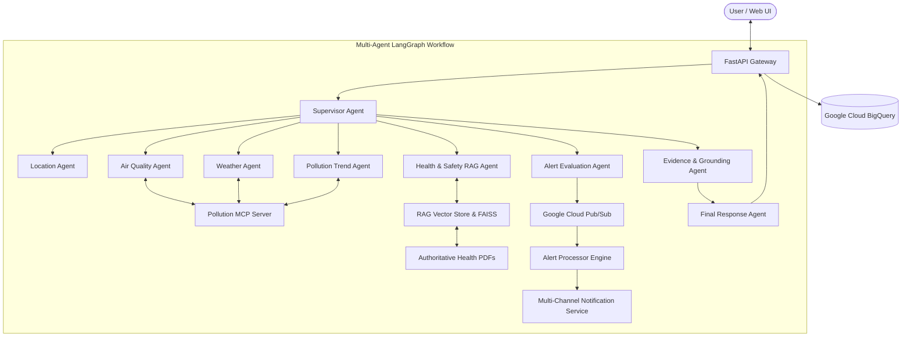

# CLEANAIR AI — Architecture Specification

CLEANAIR AI is a production-grade multi-agent environmental intelligence and safety platform built on Google Gemini, LangGraph, Model Context Protocol (MCP), Agent-to-Agent (A2A) task delegation, RAG, and Google Cloud infrastructure.

## System Guarantees
1. **Zero Measurement Fabrication**: Measured AQI, pollutant levels, weather, and timestamps originate strictly from verified station data tools via MCP.
2. **Authoritative RAG Safety Guidance**: Health and safety advice is grounded in 9 WHO/EPA compliant PDF guidelines with footnote citations.
3. **Grounding Validation Loop**: Output is validated before response assembly; fails safely if evidence is missing or corrupted.
4. **Prompt Injection Guardrails**: Neutralizes adversarial prompts attempting instruction overrides.
